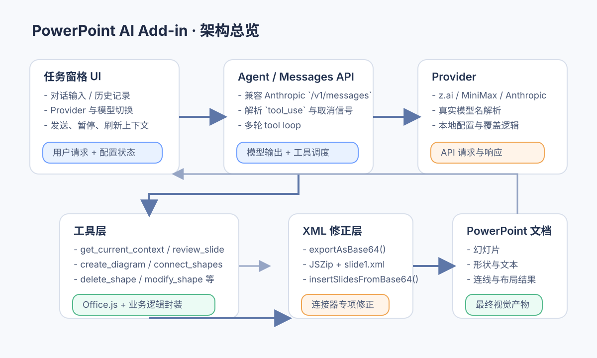
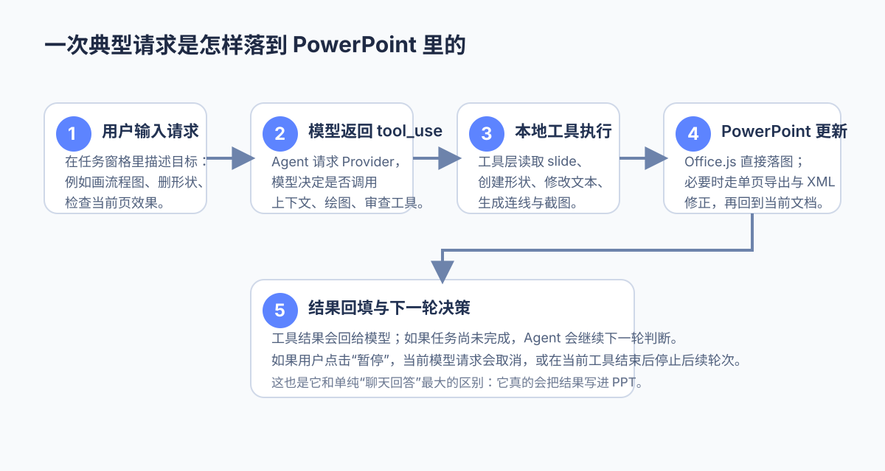

# PowerPoint AI Add-in

PowerPoint AI Add-in 是一个运行在 PowerPoint 桌面端任务窗格里的 AI 助手。它通过 Anthropic 兼容接口驱动模型，并把模型的 `tool_use` 结果真正落到当前演示文稿里，例如读取上下文、增删改形状、批量生成流程图，以及修正连接器。

## 前排提示

- 当前主要面向 **Mac 桌面版 PowerPoint** 的本地开发与调试流程。
- 图形工具依赖 Office.js，必须从 PowerPoint 功能区打开任务窗格，直接在浏览器访问 `https://localhost:3000` 只能调 UI，不能真正改 PPT。
- 连接器相关能力除了 Office.js，还会用到单页 `exportAsBase64()` + XML 修正链路，因此目标环境需要支持相应的 PowerPoint API。

## 效果预览

### 1. 整体架构



> 图 1：任务窗格、模型请求、工具注册表与 PowerPoint 文档之间的关系。

### 2. 一次典型操作链路



> 图 2：从用户发送消息，到模型发出 `tool_use`，再到 PowerPoint 中真实落图的执行过程。

## 项目特点

- **不是聊天 Demo**：模型会真实调用 `get_current_context`、`delete_shape`、`modify_shape`、`create_diagram`、`connect_shapes` 等工具修改当前演示文稿。
- **Provider 可切换**：支持 `z.ai`、`MiniMax`、`Anthropic 官方` 等 Anthropic 兼容后端，并允许在任务窗格中切换。
- **Agent 循环可暂停**：发送后按钮会切换成“暂停”，可以中断当前模型请求，并在当前工具返回后停止后续轮次。
- **支持任意页读取上下文**：模型可以按 `slideId`、`slideIndex` 或 `pageNumber` 静默查看目标页形状信息，而不要求用户先切页。
- **支持截图留档**：`review_slide` 会把截图与元数据保存到 `debug-artifacts/review-slide/`，便于排查视觉问题。
- **连接器做过专项处理**：对于复杂连线，项目会结合 Office.js 与单页 XML 修正能力，尽量生成更接近 PowerPoint 原生行为的连接结果。

## 快速开始

### 1. 安装依赖

```bash
npm install
npx office-addin-dev-certs install
cp config/providers.example.json config/providers.json
```

然后编辑 `config/providers.json`，填入你要使用的 Provider Token。

### 2. 启动本地环境

```bash
lsof -ti:3001 | xargs kill -9
npm run sideload
npm run dev
```

启动后，PowerPoint 的“开始”选项卡会出现“打开 AI 助手”按钮，点击后即可在右侧打开任务窗格。

### 3. 常用交互

- `Cmd + Enter`：发送消息
- 运行中点击“暂停”：停止当前 Agent 后续轮次
- “刷新上下文”：直接读取当前 PowerPoint 选择状态
- Provider / 模型选择：写入 `localStorage`，优先级高于配置文件默认值

## 一个最小示例

你可以直接在任务窗格里输入下面这类请求：

```text
在当前幻灯片画一个登录流程图：开始 → 输入用户名密码 → 判断是否验证通过 → 通过则进入首页、不通过则提示错误 → 结束。
```

模型会自动组合如下工具能力：

1. 读取当前页上下文
2. 计算节点布局
3. 创建形状与连线
4. 必要时修正连接器
5. 返回节点 id、连线数量与执行结果

## 目录说明

| 路径 | 说明 |
| --- | --- |
| `manifest.xml` | Office Add-in 清单 |
| `src/taskpane/` | 任务窗格 UI、聊天面板、设置页、历史记录 |
| `src/anthropic/` | `/v1/messages` 客户端、取消控制、agent loop |
| `src/tools/` | PowerPoint 工具注册表与 Office.js / XML 编辑实现 |
| `config/providers.json` | 当前 Provider 配置 |
| `config/providers.example.json` | Provider 配置示例 |
| `debug-artifacts/` | `review_slide` 生成的调试截图与元数据（已加入 `.gitignore`） |
| `testcases/` | 手工回归与工具用例文档 |

## 核心能力说明

### 任务窗格层

- 对话输入、历史记录、设置面板
- Provider 切换与模型 tier 选择
- 运行中暂停 / 取消

### Agent 层

- 兼容 Anthropic Messages API
- 解析 `tool_use`
- 把工具结果回填给模型，形成多轮 agent loop

### 工具层

- 读取幻灯片、形状、选区上下文
- 新增 / 修改 / 删除文本框、几何图形、连线
- 生成流程图、树状图、调用链图
- 视觉检查与截图保存
- 对单页 PPTX 做 export / import 级别的 XML 修正

## 关于连接器与 XML 修正

项目里有一部分连接器能力并不只依赖普通 Office.js 形状接口，而是会走 PowerPoint 单页导出与 XML 编辑能力：

1. 对目标 slide 调用 `exportAsBase64()`
2. 用 `JSZip` 读取单页包内的 `ppt/slides/slide1.xml`
3. 定位并修改目标连接器或相关节点
4. 重新压缩后通过 `insertSlidesFromBase64()` 插回
5. 删除旧 slide，完成视觉上“原位替换”的结果

这条链路主要用于处理原生连接器行为不稳定、需要更细粒度修正的场景。

## 开发命令

```bash
npm run dev         # 启动 webpack dev server
npm run build       # 生产构建
npm run build:dev   # 开发模式构建
npm run sideload    # 重新侧载到 PowerPoint 桌面端
npm run stop        # 停止 add-in 调试
npm run validate    # 校验 manifest.xml
```

## 常见问题

### 1. 为什么在浏览器里能看到页面，但工具不能执行？

因为普通浏览器环境没有 PowerPoint 宿主，自然也没有 Office.js 的 PowerPoint API。需要从 PowerPoint 桌面端真正打开任务窗格。

### 2. 为什么有些图形工具需要返回新的 slide id？

因为单页 XML 修正采用的是导出、修改、插回、删除旧页的机制。视觉上像原位修改，但底层 slide id 可能会变化。

### 3. 截图保存在哪里？

默认保存在：

```text
debug-artifacts/review-slide/
```

这里会同时写入 PNG 和同名 JSON 元数据，方便回放 `review_slide` 当时到底看到了什么。

## 适合谁用

如果你正在做下面这些事，这个项目会比较顺手：

- 想把 Anthropic 兼容模型接进 PowerPoint
- 想让模型不仅“会说”，还要“会改 PPT”
- 想调试 Office.js 与图形自动化工具链
- 想验证基于 PowerPoint 的 agent tool-use 交互方式

---

如果你准备把它继续往“稳定可用的文档生产工具”方向打磨，建议优先投入这三块：连接器可靠性、截图审查闭环、以及更清晰的工具上下文设计。这样后面的体验会顺很多。
